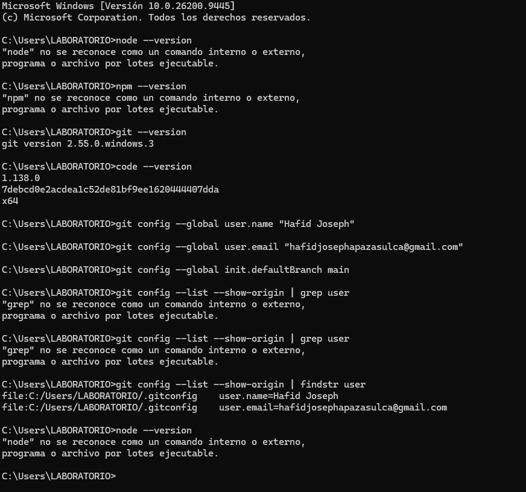
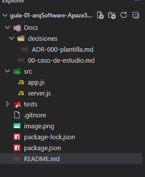

# LAB 01
## Nombres y apellidos:
Hafid Joseph Apaza Sulca
## Una breve descripción del curso.
Curso de arquitectura de software.
## Expectativas del estudiante respecto al curso.
quiero aprender desarrollar apps escalables y mantenibvles en el tiempo
## Nombre completo del docente.
LIZBETH JAICO QUISPE
 ## Además incluir la captura de imágenes del paso 1 y paso 2
 ### paso 1
 
 ### paso 2
 